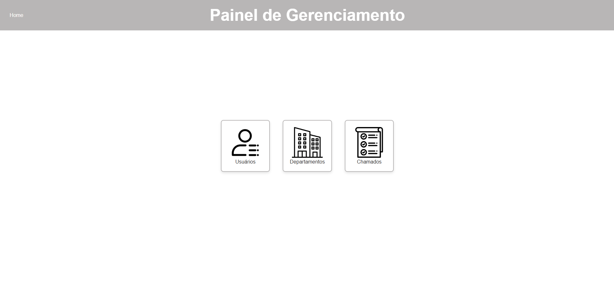
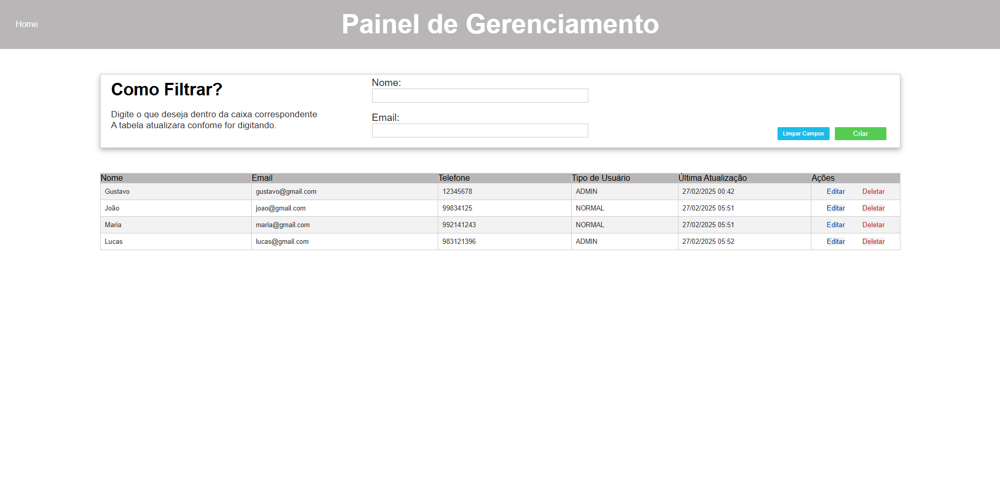
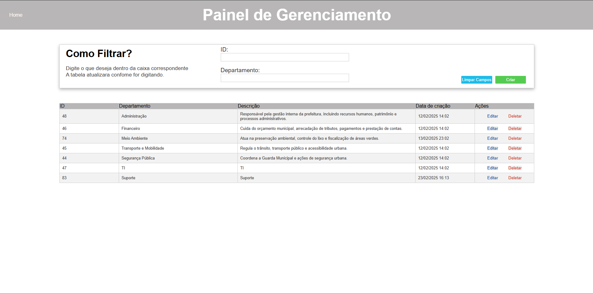
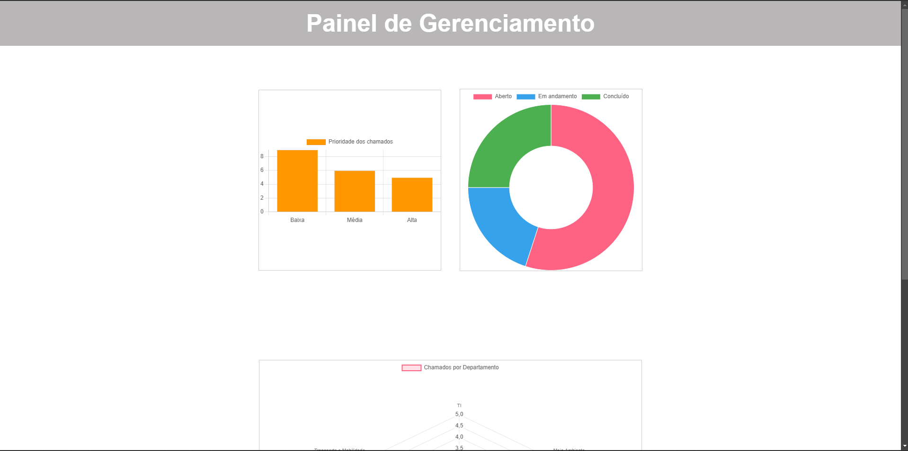
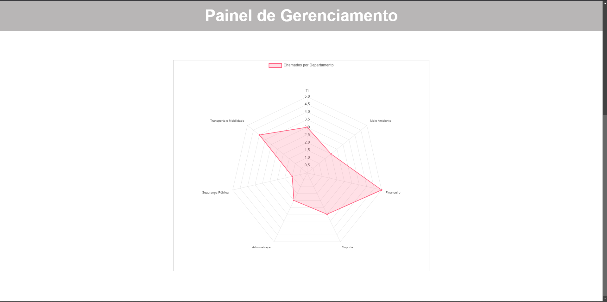
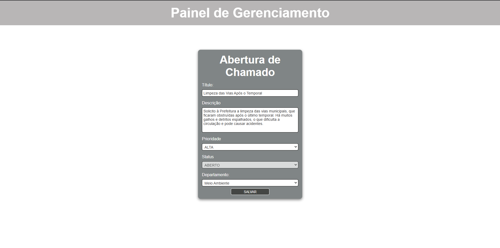

# Painel de chamados e gerenciamento 🤖

**Descrição:**  
Este projeto consiste em um sistema de gerenciamento de chamados e usuários, separado em dois repositórios diferentes: um para o [Backend](https://github.com/gxstavomiguel/sistema-backend-2), utilizando Java Spring Boot, e outro para o [Frontend](https://github.com/gxstavomiguel/sistema-frontend), utilizando AngularJS e Javascript.

---

**Frontend:**
- **Descrição:** Interface interativa para o gerenciamento de chamados, com gráficos e filtros personalizados.

---

---

## ✨ Funcionalidades

Para Administradores:
- Criação de usuários com diferentes perfis (Admin e Normal).
- Criação e gestão de departamentos, que podem ser vinculados aos chamados.
- Consultas avançadas para listar usuários e departamentos por nome, e-mail ou ID.
- Atualização e remoção de usuários e departamentos.
- Página com gráficos para o gerenciamento de chamados por departamento, prioridade ou status.

---

---

---

---

Para Usuários Normais:
- Abertura e cadastro de chamados.
---

---

## 🛠️ Tecnologias Utilizadas

- **Back-end:** Java com Spring Boot.  
- **Front-end:** AngularJS e JavaScript.  

---

## 🔧 Ferramentas Utilizadas

- **postman:** Para requisições HTTP.  
- **IDE:** IntelliJ IDEA e Visual Studio Code.
- **PostgreSQL:** Banco de Dados responsável pela permanência dos dados.

